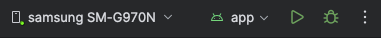

## Aplus-AOS

**2024년 가을학기 캡스톤디자인프로젝트 A조 안드로이드 저장소입니다.**

<hr />

## How to run

> Strongly recommend to use Android OS mobile phone, or emulator with Android Studio(**min sdk 31**).

1. Install Android Studio

- <a>https://developer.android.com/studio?hl=ko</a>

2. Clone repository

```terminal
git clone https://github.com/TeamA-Aplus-Capstone2024Fall/Aplus-aos.git
```

3. Click `Run 'app'` icon



<hr />

## System requirements

- Min SDK 31
- Allow your camera permission
